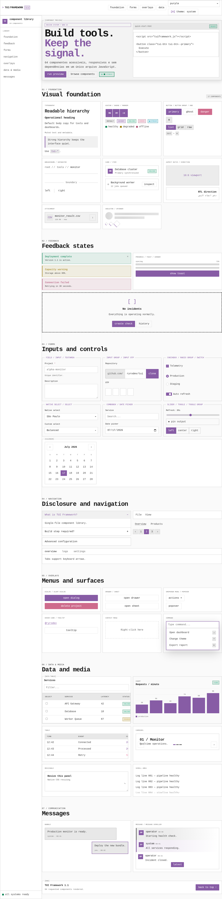

<div align="center">

# TUI Framework

**Framework web leve, reutilizável e sem dependências para interfaces inspiradas em terminais e aplicações TUI.**

[](#versão)
[](./LICENSE)
[](./tuiframework.js)
[](#recursos)
[](#componentes)

Temas claro, escuro e automático · Prefixo seguro `tui-` · Design responsivo · Acessibilidade · Tokens personalizáveis

</div>



## Sumário

- [Visão geral](#visão-geral)
- [Recursos](#recursos)
- [Arquivos](#arquivos)
- [Instalação](#instalação)
- [Início rápido](#início-rápido)
- [Galeria oficial](#galeria-oficial)
- [Temas](#temas)
- [Personalização](#personalização)
- [Componentes](#componentes)
- [Layouts e utilitários](#layouts-e-utilitários)
- [Integração com frameworks](#integração-com-frameworks)
- [Acessibilidade](#acessibilidade)
- [Compatibilidade](#compatibilidade)
- [Skill para agentes](#skill-para-agentes)
- [Contribuição](#contribuição)
- [Versão](#versão)
- [Licença](#licença)
- [Créditos](#créditos)

## Visão geral

O **TUI Framework** fornece tokens, layouts, componentes e utilitários para construir dashboards, monitores, consoles administrativos, formulários e aplicações web com estética de terminal moderna.

O projeto é distribuído em um único arquivo, `tuiframework.js`. Ele injeta o CSS automaticamente e inclui o controlador persistente dos temas claro, escuro e automático.

O framework é independente de Discord, BetterDiscord ou qualquer biblioteca de componentes.

## Recursos

- Arquivo único, sem dependências e sem etapa de compilação.
- Namespace público `tui-` para reduzir conflitos com o projeto consumidor.
- Variáveis CSS prefixadas com `--tui-`.
- Temas claro, escuro e automático pelo sistema operacional.
- Preferência de tema persistida em `localStorage`.
- Cor de destaque persistida e controlada pela API `TUIAccent`.
- Scrollbars globais adaptadas automaticamente aos temas claro e escuro.
- Cores de destaque: roxo, azul, verde, amarelo e vermelho.
- Densidade compacta, cantos arredondados opcionais e painéis translúcidos.
- Layouts responsivos para aplicações, sidebars, grids, stacks e clusters.
- Biblioteca completa com 64 componentes de estrutura, formulários, navegação, overlays, dados, mídia, comunicação e feedback.
- Foco visível, suporte a `prefers-reduced-motion` e modo `forced-colors`.
- Compatível com HTML estático, React, Vue, Svelte, Angular e outros frameworks.
- Skill dedicado para orientar agentes de IA no uso correto do design system.

## Arquivos

```text
tui-framework/
├─ tuiframework.js            # CSS, componentes, utilitários e controladores
├─ example.html               # Galeria oficial dos 64 componentes
├─ tui-framework-preview.png  # Captura da galeria de componentes
├─ validation-report.json     # Resultado das validações automatizadas
├─ SKILL.md                   # Instruções para agentes de IA
├─ THIRD_PARTY_NOTICES.md     # Créditos e licenças de referências externas
├─ LICENSE                    # Licença MIT
└─ README.md
```

## Instalação

### Via CDN com jsDelivr

Carregue o bundle diretamente do repositório GitHub:

```html
<script src="https://cdn.jsdelivr.net/gh/ryrodev/tui@refs/heads/main/tuiframework.js"></script>
```

Essa opção usa a versão mais recente disponível na branch `main`. Para produção, considere fixar uma tag ou commit específico para evitar mudanças inesperadas.

### Arquivo local

Copie apenas `tuiframework.js` para o projeto e carregue-o no `<head>`:

```html
<script src="assets/tuiframework.js"></script>
```

O arquivo injeta o stylesheet antes da renderização, resolve o tema e o destaque iniciais e expõe as APIs globais `TUIFramework`, `TUITheme`, `TUIAccent`, `TUIComponents` e `TUIToast`. Não é necessário adicionar uma tag `<link>`.

Para aplicações com uma política CSP estrita, use um `nonce` permitido no elemento `<script>`; o framework replica automaticamente esse nonce no elemento `<style>` criado:

```html
<script nonce="SEU_NONCE" src="assets/tuiframework.js"></script>
```

Por padrão, o CSS é montado automaticamente. Em integrações avançadas, desative o autoload e monte-o manualmente:

```html
<script data-tui-autoload="false" src="tuiframework.js"></script>
<script>
  TUIFramework.mountStyles();
</script>
```

## Início rápido

```html
<!doctype html>
<html lang="pt-BR" data-theme-preference="system" data-accent="purple">
<head>
  <meta charset="utf-8">
  <meta name="viewport" content="width=device-width, initial-scale=1">
  <meta name="color-scheme" content="dark light">
  <meta name="theme-color" content="#292929">
  <title>Minha aplicação</title>

  <script src="tuiframework.js"></script>
</head>
<body>
  <main class="tui-container tui-section">
    <section class="tui-panel" data-label="sistema">
      <header class="tui-panel__header">
        <h1 class="tui-panel__title">Painel principal</h1>
        <span class="tui-badge tui-badge--success">online</span>
      </header>

      <div class="tui-panel__body tui-stack">
        <p>Interface carregada com sucesso.</p>
        <button class="tui-btn tui-btn--primary" type="button">
          Executar ação
        </button>
      </div>
    </section>
  </main>
</body>
</html>
```

Abra [`example.html`](./example.html) para visualizar a galeria oficial com os 64 componentes e seus comportamentos.

## Galeria oficial

A página [`example.html`](./example.html) é a referência visual e funcional do TUI Framework. Ela demonstra os 64 componentes oficiais, seus estados, combinações, temas e comportamentos interativos sem exigir CSS de projeto.

Use a galeria para:

- conferir nomes de classes e atributos `data-tui-*`;
- comparar estados claro, escuro e automático;
- validar cores de destaque e densidade;
- observar navegação por teclado e foco visível;
- verificar composições de formulários, navegação, overlays, dados e feedback;
- manter consistência ao criar novos componentes ou páginas.

A galeria deve permanecer genérica e independente de qualquer aplicação específica. Quando um novo componente público for adicionado ao bundle, inclua uma demonstração correspondente em `example.html` e atualize a documentação.

A integração foi validada no Chromium. Consulte [`validation-report.json`](./validation-report.json) para o resumo dos testes de versão, APIs, carregamento da galeria e ausência de erros de página.

## Temas

### Alternador automático

Adicione `data-tui-theme-toggle` a um botão:

```html
<button
  class="tui-btn tui-btn--ghost tui-theme-toggle"
  type="button"
  data-tui-theme-toggle
  data-label-prefix="tema: "
  data-label-system="auto"
>
  <span class="tui-theme-toggle__icon" data-tui-theme-icon aria-hidden="true">[A]</span>
  <span data-tui-theme-label>tema: auto</span>
</button>
```

Cada clique percorre:

```text
automático → escuro → claro
```

A preferência é salva na chave `tui-theme` do `localStorage`.

### Seletor

```html
<select class="tui-select" data-tui-theme-select aria-label="Tema da interface">
  <option value="system">Automático</option>
  <option value="dark">Escuro</option>
  <option value="light">Claro</option>
</select>
```

### API do bundle

```js
console.log(TUIFramework.version); // "1.1"

// Reinsere ou remove o stylesheet em tempo de execução.
TUIFramework.mountStyles();
TUIFramework.removeStyles();

// A API de tema também está disponível no namespace principal.
TUIFramework.theme.set('dark');
```

### API JavaScript

```js
TUITheme.set('light');
TUITheme.set('dark');
TUITheme.set('system');
TUITheme.cycle();

console.log(TUITheme.getPreference());
console.log(TUITheme.getResolvedTheme());
```

Mudanças disparam o evento `tui:themechange`:

```js
window.addEventListener('tui:themechange', (event) => {
  console.log(event.detail.preference);
  console.log(event.detail.resolvedTheme);
});
```

### Cor de destaque persistente

Use um seletor com `data-tui-accent-select`:

```html
<select class="tui-accent-select" data-tui-accent-select aria-label="Cor de destaque">
  <option value="purple">Roxo</option>
  <option value="blue">Azul</option>
  <option value="green">Verde</option>
  <option value="yellow">Amarelo</option>
  <option value="red">Vermelho</option>
</select>
```

Ou controle por JavaScript:

```js
TUIAccent.set('green');
console.log(TUIAccent.get());

TUIFramework.accent.set('blue');
```

A escolha é salva na chave `tui-accent`. Mudanças disparam `tui:accentchange`.

### Tema inicial fixo

O JavaScript continua necessário porque ele contém o CSS. Defina o tema inicial no `<html>`:

```html
<html data-theme-preference="light">
```

## Personalização

### Atributos globais

```html
<html
  data-theme-preference="system"
  data-accent="blue"
  data-rounded="false"
  data-density="compact"
  data-translucent="false"
  data-motion="on"
>
```

| Atributo | Valores | Efeito |
|---|---|---|
| `data-theme-preference` | `system`, `dark`, `light` | Define a preferência gerenciada por `tuiframework.js`. |
| `data-theme` | `dark`, `light` | Representa o tema efetivamente aplicado. |
| `data-accent` | `purple`, `blue`, `green`, `yellow`, `red` | Altera a cor de destaque. |
| `data-rounded` | `true`, `false` | Ativa ou remove cantos arredondados. |
| `data-density` | `compact` | Reduz espaços e altura dos controles. |
| `data-translucent` | `true`, `false` | Ativa superfícies translúcidas e desfoque. |
| `data-motion` | `on`, `off` | Ativa ou desativa transições. |

### Tokens CSS

Sobrescreva tokens em um `<style>` carregado depois de `tuiframework.js`:

```css
:root {
  --tui-font: "JetBrains Mono", monospace;
  --tui-gap: 16px;
  --tui-panel-radius: 6px;

  --tui-accent-1: var(--tui-blue-1);
  --tui-accent-2: var(--tui-blue-2);
  --tui-accent-3: var(--tui-blue-3);
  --tui-accent-4: var(--tui-blue-4);
  --tui-accent-5: var(--tui-blue-5);
}
```

Principais grupos de tokens:

```css
/* Tipografia */
--tui-font
--tui-font-sans
--tui-code-font
--tui-font-weight
--tui-letter-spacing
--tui-line-height
--tui-font-size-xs /* até --tui-font-size-xl */

/* Espaçamento e dimensões */
--tui-gap
--tui-space-1 /* até --tui-space-16 */
--tui-content-width
--tui-sidebar-width
--tui-header-height
--tui-control-height

/* Superfícies */
--tui-body-bg
--tui-panel-bg
--tui-panel-bg-raised
--tui-input-bg
--tui-border
--tui-border-soft
--tui-border-hover
--tui-panel-radius

/* Estados */
--tui-success
--tui-warning
--tui-danger
--tui-info
--tui-success-text
--tui-danger-text
--tui-info-text
--tui-warning-text
--tui-online
--tui-idle
--tui-dnd
--tui-offline
```

## Componentes

A página [`example.html`](./example.html) é a galeria oficial dos **64 componentes** do framework. Ela utiliza **todos os componentes abaixo sem carregar CSS adicional**, servindo como referência visual e estrutural para novos projetos.

### Catálogo completo

| Grupo | Componentes |
|---|---|
| Estrutura | Aspect Ratio, Card, Direction, Item, Resizable, Scroll Area, Separator, Sidebar |
| Identidade | Attachment, Avatar, Badge, Breadcrumb, Kbd, Label, Marker, Typography |
| Ações | Button, Button Group, Toggle, Toggle Group |
| Formulários | Checkbox, Combobox, Date Picker, Field, Input, Input Group, Input OTP, Native Select, Radio Group, Select, Slider, Switch, Textarea |
| Navegação | Accordion, Collapsible, Menubar, Navigation Menu, Pagination, Tabs |
| Menus e overlays | Alert Dialog, Context Menu, Dialog, Drawer, Dropdown Menu, Hover Card, Popover, Sheet, Tooltip |
| Dados e mídia | Calendar, Carousel, Chart, Data Table, Progress, Skeleton, Spinner, Table |
| Comunicação | Bubble, Message, Message Scroller |
| Feedback | Alert, Empty, Sonner, Toast |
| Comandos | Command |

Os nomes marcados como `New` na lista de requisitos foram incorporados aos nomes estáveis `Attachment`, `Bubble`, `Marker`, `Message` e `Message Scroller`.

### Convenções de interação

Componentes interativos usam atributos `data-tui-*`. O bundle vincula os comportamentos automaticamente após o carregamento do documento.

```html
<script src="tuiframework.js"></script>

<button
  class="tui-btn tui-btn--primary"
  data-tui-dialog-open="deploy-dialog"
>
  Open dialog
</button>

<dialog class="tui-dialog" id="deploy-dialog">
  <div class="tui-dialog__surface">
    <header class="tui-dialog__header">
      <h2 class="tui-dialog__title">Deploy</h2>
      <button class="tui-btn tui-btn--icon" data-tui-dialog-close>×</button>
    </header>
    <div class="tui-dialog__body">Confirm deployment?</div>
  </div>
</dialog>
```

### APIs de componentes

```js
TUIComponents.bind();
TUIComponents.open('deploy-dialog');
TUIComponents.close('deploy-dialog');

// Novidades da versão 1.1.
TUIComponents.status('connection-status', 'success', 'conectado', { pulse: true });
TUIComponents.setToggle('filter-today', true);
TUIComponents.setCollapsible('details-trigger', 'details-panel', true);

TUIToast.show({
  title: 'Saved',
  description: 'Configuration persisted.',
  variant: 'success'
});
```

As APIs também estão disponíveis por `TUIFramework.components` e `TUIFramework.toast`.


A versão 1.1 também emite eventos para integração com lógica de aplicação:

```js
document.addEventListener('tui:togglechange', (event) => {
  console.log(event.detail.value, event.detail.pressed);
});

document.addEventListener('tui:collapsiblechange', (event) => {
  console.log(event.detail.targetId, event.detail.open);
});
```

Grupos de seleção única podem impedir que todos os itens sejam desmarcados:

```html
<div data-tui-toggle-group="single" data-tui-toggle-required="true">
  <button data-tui-toggle data-value="all" aria-pressed="true">Tudo</button>
  <button data-tui-toggle data-value="today" aria-pressed="false">Hoje</button>
</div>
```

### Accordion e Collapsible

```html
<div class="tui-accordion" data-tui-accordion="single">
  <div class="tui-accordion__item">
    <button
      class="tui-accordion__trigger"
      data-tui-accordion-trigger
      aria-controls="accordion-panel"
    >
      Configuration
    </button>
    <div class="tui-accordion__content" id="accordion-panel" hidden>
      Content
    </div>
  </div>
</div>
```

Use `data-tui-accordion="single"` para manter apenas um item aberto. O `Collapsible` segue o mesmo padrão com `data-tui-collapsible-trigger`.

### Formulários

```html
<label class="tui-field">
  <span class="tui-label tui-label--required">Project</span>
  <input class="tui-input" placeholder="monitor-alpha">
  <span class="tui-field__hint">Use a unique identifier.</span>
</label>

<label class="tui-switch">
  <input type="checkbox" checked>
  <span class="tui-switch__track">
    <span class="tui-switch__thumb"></span>
  </span>
  <span>Auto refresh</span>
</label>
```

Para seleção customizada, use `data-tui-select`, `data-tui-select-trigger`, `data-tui-select-menu` e `data-tui-select-option`. Para busca, use o conjunto `data-tui-combobox-*`.

### Tabs

```html
<section class="tui-panel" data-tui-tabs>
  <div class="tui-tabs" role="tablist">
    <button class="tui-tab" role="tab" aria-selected="true" aria-controls="tab-a">
      Overview
    </button>
    <button class="tui-tab" role="tab" aria-selected="false" aria-controls="tab-b">
      Logs
    </button>
  </div>
  <div class="tui-panel__body" id="tab-a" role="tabpanel">Overview</div>
  <div class="tui-panel__body" id="tab-b" role="tabpanel" hidden>Logs</div>
</section>
```

As setas esquerda e direita movem o foco entre abas.

### Dropdown, Popover e menus

```html
<div class="tui-dropdown">
  <button class="tui-btn" data-tui-menu-trigger aria-controls="actions-menu">
    Actions
  </button>
  <div class="tui-dropdown__menu" id="actions-menu" hidden>
    <button class="tui-dropdown__item">Duplicate</button>
    <button class="tui-dropdown__item">Archive</button>
  </div>
</div>
```

O mesmo controlador atende `Menubar`, `Navigation Menu`, `Popover` e `Select`. Menus temporários fecham ao clicar fora, rolar a página ou pressionar `Esc`.

### Calendar e Date Picker

O `Date Picker` usa o controle nativo do navegador com o estilo `tui-input`. O `Calendar` fornece uma grade visual selecionável:

```html
<div class="tui-calendar" data-tui-calendar>
  <button
    class="tui-calendar__day"
    data-tui-calendar-day
    data-value="2026-07-17"
    aria-selected="true"
  >17</button>
</div>
```

A seleção dispara o evento `tui:calendarchange`.

### Data Table

```html
<table class="tui-table tui-data-table">
  <thead>
    <tr>
      <th data-tui-sort aria-sort="none">Service</th>
      <th data-tui-sort aria-sort="none">Latency</th>
    </tr>
  </thead>
  <tbody>
    <tr>
      <td>API Gateway</td>
      <td>42</td>
    </tr>
  </tbody>
</table>
```

Cabeçalhos com `data-tui-sort` alternam entre ordem crescente e decrescente. Checkboxes com `data-tui-row-select` atualizam o estado visual da linha.

### Carousel

```html
<div class="tui-carousel" data-tui-carousel>
  <div class="tui-carousel__viewport">
    <div class="tui-carousel__track">
      <article class="tui-carousel__slide">Slide A</article>
      <article class="tui-carousel__slide">Slide B</article>
    </div>
  </div>
  <button data-tui-carousel-action="prev">Previous</button>
  <button data-tui-carousel-action="next">Next</button>
</div>
```

Também é possível usar o índice numérico em `data-tui-carousel-action` para criar indicadores.

### Toast e Sonner

```html
<button
  class="tui-btn tui-btn--primary"
  data-tui-toast
  data-title="Saved"
  data-description="Configuration updated."
  data-variant="success"
>
  Save
</button>

<div class="tui-sonner" data-tui-sonner aria-live="polite"></div>
```

Variantes disponíveis: `success`, `warning` e `danger`.

### Componentes puramente visuais

Os componentes abaixo não exigem JavaScript:

```text
Alert            Aspect Ratio      Attachment       Avatar
Badge            Breadcrumb        Bubble           Button
Button Group      Card              Chart            Checkbox
Direction        Empty             Field            Hover Card
Input            Input Group       Item             Kbd
Label            Marker            Message          Native Select
Progress         Radio Group       Resizable        Scroll Area
Separator        Sidebar           Skeleton         Spinner
Switch           Table             Textarea         Tooltip
Typography
```

### Padrão de design

Ao criar novas páginas:

1. Use painéis, cards e tokens do framework antes de criar CSS específico.
2. Preserve bordas retas, tipografia monoespaçada, contraste alto e espaçamento compacto.
3. Use cores semânticas apenas para estado ou ação.
4. Mantenha atributos ARIA, foco visível e suporte a teclado.
5. Adicione um novo padrão ao framework quando ele puder ser reutilizado por outras ferramentas.

## Layouts e utilitários

Layouts principais:

```html
<main class="tui-container">...</main>
<div class="tui-stack">...</div>
<div class="tui-cluster">...</div>
<div class="tui-split">...</div>
<div class="tui-grid tui-grid--3">...</div>
<div class="tui-grid tui-grid--5">...</div>
<div class="tui-grid tui-grid--6">...</div>
```

Estrutura de aplicação:

```html
<div class="tui-app">
  <header class="tui-app__header tui-topbar">...</header>
  <aside class="tui-app__sidebar tui-sidebar">...</aside>
  <main class="tui-app__main">...</main>
</div>
```

Utilitários disponíveis incluem:

```text
tui-flex              tui-inline-flex       tui-grid-display
tui-grow              tui-items-center      tui-justify-between
tui-wrap              tui-gap-1..6          tui-p-0..6
tui-mt-2..6           tui-mb-2..4           tui-w-full
tui-text-left         tui-text-center       tui-text-right
tui-text-accent       tui-text-success      tui-text-danger
tui-font-medium       tui-font-bold         tui-uppercase
tui-truncate          tui-hidden            tui-sr-only
tui-hide-tablet       tui-hide-mobile
tui-hide-lt-xl        tui-hide-lt-lg       tui-hide-lt-md
tui-hide-lt-sm        tui-overflow-hidden
```

Para padrões repetidos ou regras de negócio, prefira criar classes próprias do projeto em vez de combinar muitos utilitários.

## Integração com frameworks

As classes podem ser usadas diretamente em qualquer framework que renderize HTML.

Exemplo em React:

```jsx
export function MetricCard({ label, value, delta }) {
  return (
    <article className="tui-card tui-metric">
      <span className="tui-metric__label">{label}</span>
      <strong className="tui-metric__value">{value}</strong>
      <span className="tui-metric__delta tui-metric__delta--up">
        {delta}
      </span>
    </article>
  );
}
```

## Acessibilidade

- Use `<button>` para ações e `<a>` para navegação.
- Associe todos os campos a um `<label>` ou `aria-label`.
- Não comunique estados apenas por cor.
- Mantenha uma ordem lógica de títulos.
- Forneça `<th>` em tabelas de dados.
- Atualize `aria-selected`, `aria-controls` e `hidden` ao implementar abas.
- Use `<dialog>` ou um padrão ARIA completo em modais.
- Preserve o foco visível fornecido pelo framework.
- O framework respeita `prefers-reduced-motion` automaticamente.

## Compatibilidade

O TUI Framework utiliza recursos modernos do CSS, incluindo custom properties, cascade layers, `oklch()` e `color-mix()`.

Use versões atuais dos navegadores Chrome, Edge, Firefox e Safari. Projetos destinados a navegadores antigos devem adicionar fallbacks próprios para cores e recursos modernos.

## Skill para agentes

O arquivo [`SKILL.md`](./SKILL.md) orienta agentes de IA a:

- verificar classes existentes antes de gerar código;
- reutilizar componentes do framework;
- personalizar interfaces por tokens;
- preservar responsividade e acessibilidade;
- usar corretamente o controlador de temas;
- evitar classes `tui-*` inexistentes.

Inclua o arquivo junto do projeto quando agentes automatizados forem responsáveis por criar ou manter interfaces.

## Contribuição

Contribuições são bem-vindas.

1. Crie um fork do projeto.
2. Abra uma branch para a alteração.
3. Mantenha todas as classes públicas com o prefixo `tui-`.
4. Não introduza dependências obrigatórias sem justificativa.
5. Atualize `example.html` e o README quando adicionar componentes públicos.
6. Teste os temas claro, escuro e automático.
7. Verifique navegação por teclado e comportamento responsivo.
8. Abra um pull request explicando o problema e a solução.

Antes de propor uma nova classe, confirme que a necessidade não pode ser atendida por um componente ou token existente.

## Versão

Versão atual: **1.1**.


### Alterações da 1.1

- API `TUIComponents.status()` para status pills sem manipulação manual de classes;
- API `TUIComponents.setToggle()` com evento `tui:togglechange`;
- grupos de toggle com seleção única obrigatória por `data-tui-toggle-required="true"`;
- API `TUIComponents.setCollapsible()` e rótulos automáticos de abrir/fechar;
- evento `tui:collapsiblechange`;
- estados visuais oficiais para linhas novas e status pulsante;
- Galeria oficial atualizada para demonstrar as APIs e os estados adicionados na versão 1.1.

O projeto segue uma estratégia simples de versionamento:

- correções compatíveis incrementam a versão de patch;
- novos recursos compatíveis incrementam a versão minor;
- alterações incompatíveis de classes, tokens ou API incrementam a versão major.

## Licença

Distribuído sob a licença **MIT**. Consulte [`LICENSE`](./LICENSE).

A licença MIT permite uso pessoal e comercial, modificação, distribuição e sublicenciamento, desde que o aviso de copyright e a licença sejam preservados.

## Créditos

A linguagem visual inicial foi inspirada no projeto **system24**, criado por **refact0r** e distribuído sob a licença MIT.

O TUI Framework é um projeto web independente, não possui dependência de execução do system24 e não é afiliado oficialmente ao autor do tema original.

Consulte [`THIRD_PARTY_NOTICES.md`](./THIRD_PARTY_NOTICES.md) para atribuições completas.
